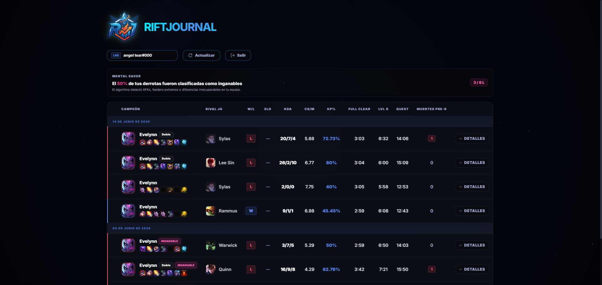

# RiftJournal

Performance telemetry and mental tracking platform for League of Legends ranked matches. It extracts frame-by-frame match events from the Riot Games API to track objective timings, early-game execution, spatial positioning, and subjective tilt factors.

<br>

<p align="center">
  <a href="https://riftjournal.daemonize.me" target="_blank" rel="noopener noreferrer">
    
  </a>
</p>

<br>

<p align="center">
  
</p>

## Architecture and Design

The application uses a decoupled client-server architecture:

```
[Riot Games API] <--- httpx --- [FastAPI Backend] <--- asyncpg ---> [PostgreSQL 15]
                                        ^
                                        | REST (JSON / Bearer JWT)
                                        v
                               [Next.js 16 Client]
```

### Telemetry Pipeline
1. **Identity Resolution**: Resolves Riot ID (`GameName#Tag`) to persistent PUUID via `ACCOUNT-V1`.
2. **Match Ingestion**: Fetches recent Solo/Duo matches via `MATCH-V5`, detecting the opponent jungler through equipped summoner spells (Smite) and position metadata.
3. **Timeline Processing**: Parses the 60-second frame timeline from `MATCH-TIMELINE-V5`:
   - **Level 6 Timestamp**: Identifies the exact second the player reaches level 6 through `LEVEL_UP` events.
   - **Full Clear Time**: Measures when level 4 / 24 CS is achieved within early jungle clear windows.
   - **Role Quest Completion**: Tracks jungle companion upgrade completion via `ITEM_DESTROYED` / `ITEM_PURCHASED` event IDs.
   - **Early Deaths**: Counts deaths occurring prior to the 6-minute mark (timestamp <= 360s).
   - **Diffs at 10m**: Computes gold and XP differentials (`GD@10`, `XPD@10`) against the rival jungler at frame 10.
4. **Spatial Mapping**: Normalizes native Summoner's Rift game coordinates (0 to 15,000) into relative percentages to plot kills, ganks, and deaths interactively on a 2D map.
5. **Psychological Tracking (Tiltometer)**: Records tilt levels (0: Calm, 1: Physical Tension, 2: Logic Loss, 3: Full Tilt), triggers, recovery durations, and links errors via a many-to-many relationship with an error catalog.

## Tech Stack

- **Backend**: Python 3.11, FastAPI, SQLAlchemy 2.0 (asyncio), asyncpg, httpx, Pydantic v2, PyJWT, passlib
- **Frontend**: Next.js 16.2 (App Router), React 19, TypeScript 5, Tailwind CSS v4, Lucide React
- **Database**: PostgreSQL 15
- **Infrastructure**: Docker Compose, Nginx Proxy Manager (reverse proxy)

## Project Structure

```
performance-tracker/
├── backend/
│   ├── app/
│   │   ├── config/          # Pydantic BaseSettings and env loading
│   │   ├── database/        # Async SQLAlchemy engine and session pool
│   │   ├── models/          # Database entities (matches, errors, matchups)
│   │   ├── routers/         # API endpoints (matches, matchups, auth)
│   │   ├── schemas/         # Pydantic request/response schemas
│   │   ├── services/        # Riot API client and database operations
│   │   └── main.py          # FastAPI application entrypoint
│   ├── Dockerfile
│   └── requirements.txt
├── frontend/
│   ├── src/
│   │   ├── app/             # Next.js App Router pages and layout
│   │   ├── components/      # UI components (MatchMap, modals, dropdowns)
│   │   ├── config/          # Constants and Data Dragon asset references
│   │   └── services/        # Frontend API client
│   ├── Dockerfile
│   └── package.json
└── docker-compose.yml
```

## Local Setup

### Prerequisites
- Docker and Docker Compose
- Riot Games API key (developer.riotgames.com)

### Running with Docker

1. Clone the repository:
   ```bash
   git clone https://github.com/daemon1s/riftjournal-riot-fastapi-nextjs-postgres.git
   cd riftjournal-riot-fastapi-nextjs-postgres
   ```

2. Create `.env` in the root directory:
   ```env
   POSTGRES_USER=evelynnuser
   POSTGRES_PASSWORD=your_db_password
   POSTGRES_DB=evelynndb
   DATABASE_URL=postgresql+asyncpg://evelynnuser:your_db_password@db:5432/evelynndb
   SECRET_KEY=your_jwt_secret_key
   RIOT_API_KEY=RGAPI-your-riot-api-key
   NEXT_PUBLIC_API_URL=http://localhost:8010
   ```

3. Start services:
   ```bash
   docker compose up -d --build
   ```

4. Access points:
   - Frontend: `http://localhost:3010`
   - Backend API Docs: `http://localhost:8010/docs`
